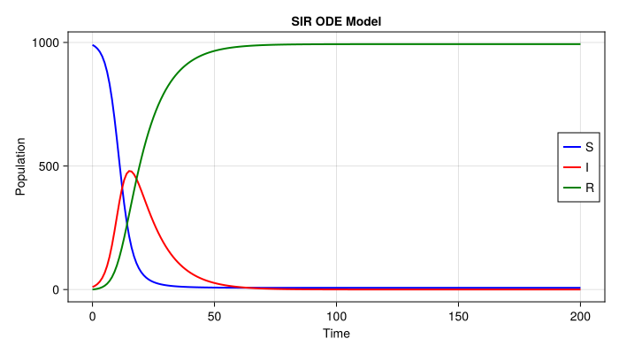
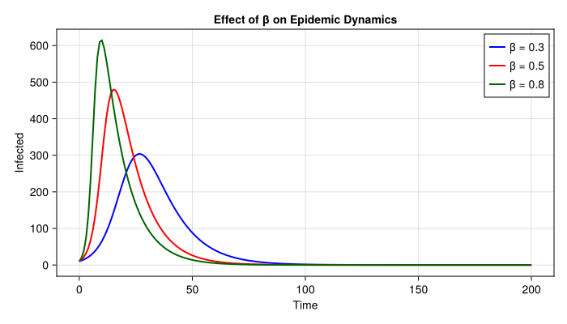

# Basic ODE Model: SIR


- [Introduction](#introduction)
- [Model Definition](#model-definition)
- [Simulation](#simulation)
- [Plot](#plot)
- [Parameter Exploration](#parameter-exploration)
- [Verification](#verification)
- [Final Size](#final-size)

## Introduction

This vignette demonstrates how to define and simulate a basic SIR
(Susceptible-Infected-Recovered) ordinary differential equation model
using
[ModelingToolkit.jl](https://docs.sciml.ai/ModelingToolkit/stable/) and
[DifferentialEquations.jl](https://docs.sciml.ai/DiffEqDocs/stable/).
This is the Julia companion to the R odin2/dust2 vignette in the `R/`
subdirectory.

## Model Definition

We define the SIR model using ModelingToolkit’s symbolic ODE system
interface.

``` julia
using ModelingToolkit
using ModelingToolkit: t_nounits as t, D_nounits as D
using DifferentialEquations
using CairoMakie

@parameters β=0.5 γ=0.1 N=1000.0
@variables S(t)=990.0 I(t)=10.0 R(t)=0.0

eqs = [
    D(S) ~ -β * S * I / N,
    D(I) ~ β * S * I / N - γ * I,
    D(R) ~ γ * I,
]

@named sir = ODESystem(eqs, t)
sir = structural_simplify(sir)
```

    Model sir:
    Equations (3):
      3 standard: see equations(sir)
    Unknowns (3): see unknowns(sir)
      R(t)
      I(t)
      S(t)
    Parameters (3): see parameters(sir)
      β
      N
      γ

## Simulation

``` julia
tspan = (0.0, 200.0)
prob = ODEProblem(sir, [], tspan)
sol = solve(prob, Tsit5(); saveat=1.0)
```

    retcode: Success
    Interpolation: 1st order linear
    t: 201-element Vector{Float64}:
       0.0
       1.0
       2.0
       3.0
       4.0
       5.0
       6.0
       7.0
       8.0
       9.0
       ⋮
     192.0
     193.0
     194.0
     195.0
     196.0
     197.0
     198.0
     199.0
     200.0
    u: 201-element Vector{Vector{Float64}}:
     [0.0, 10.0, 990.0]
     [1.2256735263326937, 14.82285698700851, 983.9514694866589]
     [3.039116905002312, 21.890791489216795, 975.0700916057809]
     [5.710026445280262, 32.154942473426296, 962.1350310812935]
     [9.617931882125196, 46.864127828921, 943.5179402889539]
     [15.28176862081051, 67.54526185749775, 917.1729695216918]
     [23.38121496686507, 95.84743680913516, 880.7713482239998]
     [34.751849681608654, 133.15495897901639, 832.093191339375]
     [50.3301898060552, 179.93024296022747, 769.7395672337174]
     [71.01313171569856, 234.88003845387829, 694.1068298304232]
     ⋮
     [993.1020126899583, 2.954717000927666e-5, 6.897957762871682]
     [993.1020155077106, 2.682660138126704e-5, 6.897957665688001]
     [993.1020180667329, 2.43558392891366e-5, 6.897957577427866]
     [993.1020203896807, 2.2113009440039076e-5, 6.897957497309889]
     [993.1020224977766, 2.0077621239763795e-5, 6.897957424602107]
     [993.1020244108103, 1.823056779273564e-5, 6.897957358621987]
     [993.1020261471376, 1.6554125902015024e-5, 6.897957298736423]
     [993.1020277236822, 1.5031956069297889e-5, 6.89795724436174]
     [993.1020291559338, 1.3649102494915839e-5, 6.897957194963688]

## Plot

``` julia
fig = Figure(size=(700, 400))
ax = Axis(fig[1, 1]; xlabel="Time", ylabel="Population", title="SIR ODE Model")
lines!(ax, sol.t, sol[sir.S]; label="S", color=:blue, linewidth=2)
lines!(ax, sol.t, sol[sir.I]; label="I", color=:red, linewidth=2)
lines!(ax, sol.t, sol[sir.R]; label="R", color=:green, linewidth=2)
axislegend(ax; position=:rc)
fig
```



## Parameter Exploration

``` julia
betas = [0.3, 0.5, 0.8]
colors = [:blue, :red, :darkgreen]

fig2 = Figure(size=(700, 400))
ax2 = Axis(fig2[1, 1]; xlabel="Time", ylabel="Infected",
           title="Effect of β on Epidemic Dynamics")

for (i, β_val) in enumerate(betas)
    prob_i = remake(prob; p=[sir.β => β_val])
    sol_i = solve(prob_i, Tsit5(); saveat=1.0)
    lines!(ax2, sol_i.t, sol_i[sir.I]; label="β = $β_val",
           color=colors[i], linewidth=2)
end
axislegend(ax2; position=:rt)
fig2
```



## Verification

``` julia
total = sol[sir.S] .+ sol[sir.I] .+ sol[sir.R]
println("Population at t=0: ", total[1])
println("Population at t=200: ", total[end])
println("Max deviation: ", maximum(abs.(total .- 1000)))
```

    Population at t=0: 1000.0
    Population at t=200: 1000.0
    Max deviation: 2.2737367544323206e-13

## Final Size

``` julia
final_R = sol[sir.R][end]
println("Final epidemic size: ", round(final_R; digits=1), " out of 1000")
println("Attack rate: ", round(100 * final_R / 1000; digits=1), "%")
```

    Final epidemic size: 993.1 out of 1000
    Attack rate: 99.3%
