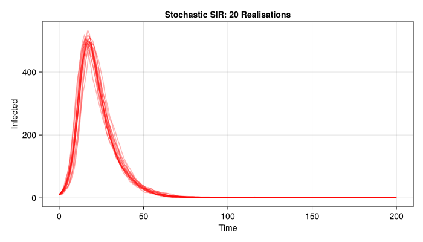
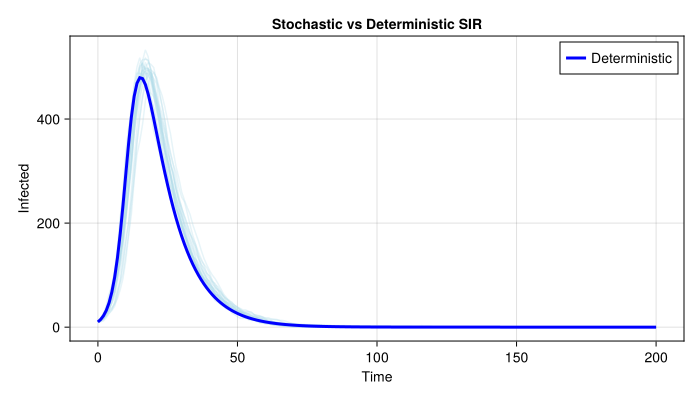

# Stochastic Discrete-Time SIR


- [Introduction](#introduction)
- [Model Definition](#model-definition)
- [Multiple Realisations](#multiple-realisations)
- [Comparing to Deterministic](#comparing-to-deterministic)

## Introduction

This vignette demonstrates a stochastic discrete-time SIR model. In the
R odin2/dust2 ecosystem, stochastic models use `update()` with
`Binomial` draws. Here we implement the equivalent using a direct
discrete-time simulation with `Distributions.jl`, then compare against
the deterministic ODE solution from ModelingToolkit.jl.

## Model Definition

We define a discrete-time stochastic SIR simulator as a simple function.
Each time step, the number of new infections and recoveries are drawn
from Binomial distributions.

``` julia
using Distributions
using Random
using CairoMakie
using ModelingToolkit
using DifferentialEquations

function sir_stochastic!(state, pars, dt)
    S, I, R = state
    β, γ, N = pars.β, pars.γ, pars.N

    p_SI = 1 - exp(-β * I / N * dt)
    p_IR = 1 - exp(-γ * dt)
    n_SI = rand(Binomial(round(Int, S), clamp(p_SI, 0, 1)))
    n_IR = rand(Binomial(round(Int, I), clamp(p_IR, 0, 1)))

    state[1] = S - n_SI
    state[2] = I + n_SI - n_IR
    state[3] = R + n_IR
    return state
end

function simulate_stochastic(pars, times; seed=42)
    rng = Random.seed!(seed)
    state = [pars.N - pars.I0, Float64(pars.I0), 0.0]
    dt = times[2] - times[1]
    result = zeros(3, length(times))
    result[:, 1] .= state
    for i in 2:length(times)
        sir_stochastic!(state, pars, dt)
        result[:, i] .= state
    end
    return result
end
```

    simulate_stochastic (generic function with 1 method)

## Multiple Realisations

``` julia
pars = (β=0.5, γ=0.1, I0=10.0, N=1000.0)
times = collect(0.0:1.0:200.0)
n_particles = 20

results = [simulate_stochastic(pars, times; seed=42 + i) for i in 1:n_particles]

fig = Figure(size=(700, 400))
ax = Axis(fig[1, 1]; xlabel="Time", ylabel="Infected",
          title="Stochastic SIR: $n_particles Realisations")
for res in results
    lines!(ax, times, res[2, :]; color=(:red, 0.3))
end
fig
```



## Comparing to Deterministic

``` julia
using ModelingToolkit
using ModelingToolkit: t_nounits as t, D_nounits as D
using DifferentialEquations

@parameters β_d=0.5 γ_d=0.1 N_d=1000.0
@variables S_d(t)=990.0 I_d(t)=10.0 R_d(t)=0.0

eqs_det = [
    D(S_d) ~ -β_d * S_d * I_d / N_d,
    D(I_d) ~ β_d * S_d * I_d / N_d - γ_d * I_d,
    D(R_d) ~ γ_d * I_d,
]

@named sir_det = ODESystem(eqs_det, t)
sir_det = structural_simplify(sir_det)
prob = ODEProblem(sir_det, [], (0.0, 200.0))
sol = solve(prob, Tsit5(); saveat=1.0)
```

    retcode: Success
    Interpolation: 1st order linear
    t: 201-element Vector{Float64}:
       0.0
       1.0
       2.0
       3.0
       4.0
       5.0
       6.0
       7.0
       8.0
       9.0
       ⋮
     192.0
     193.0
     194.0
     195.0
     196.0
     197.0
     198.0
     199.0
     200.0
    u: 201-element Vector{Vector{Float64}}:
     [0.0, 10.0, 990.0]
     [1.2256735263326937, 14.82285698700851, 983.9514694866589]
     [3.039116905002312, 21.890791489216795, 975.0700916057809]
     [5.710026445280262, 32.154942473426296, 962.1350310812935]
     [9.617931882125196, 46.864127828921, 943.5179402889539]
     [15.28176862081051, 67.54526185749775, 917.1729695216918]
     [23.38121496686507, 95.84743680913516, 880.7713482239998]
     [34.751849681608654, 133.15495897901639, 832.093191339375]
     [50.3301898060552, 179.93024296022747, 769.7395672337174]
     [71.01313171569856, 234.88003845387829, 694.1068298304232]
     ⋮
     [993.1020126899583, 2.954717000927666e-5, 6.897957762871682]
     [993.1020155077106, 2.682660138126704e-5, 6.897957665688001]
     [993.1020180667329, 2.43558392891366e-5, 6.897957577427866]
     [993.1020203896807, 2.2113009440039076e-5, 6.897957497309889]
     [993.1020224977766, 2.0077621239763795e-5, 6.897957424602107]
     [993.1020244108103, 1.823056779273564e-5, 6.897957358621987]
     [993.1020261471376, 1.6554125902015024e-5, 6.897957298736423]
     [993.1020277236822, 1.5031956069297889e-5, 6.89795724436174]
     [993.1020291559338, 1.3649102494915839e-5, 6.897957194963688]

``` julia
fig2 = Figure(size=(700, 400))
ax2 = Axis(fig2[1, 1]; xlabel="Time", ylabel="Infected",
           title="Stochastic vs Deterministic SIR")
for res in results
    lines!(ax2, times, res[2, :]; color=(:lightblue, 0.3))
end
lines!(ax2, sol.t, sol[sir_det.I_d]; color=:blue, linewidth=3, label="Deterministic")
axislegend(ax2; position=:rt)
fig2
```


