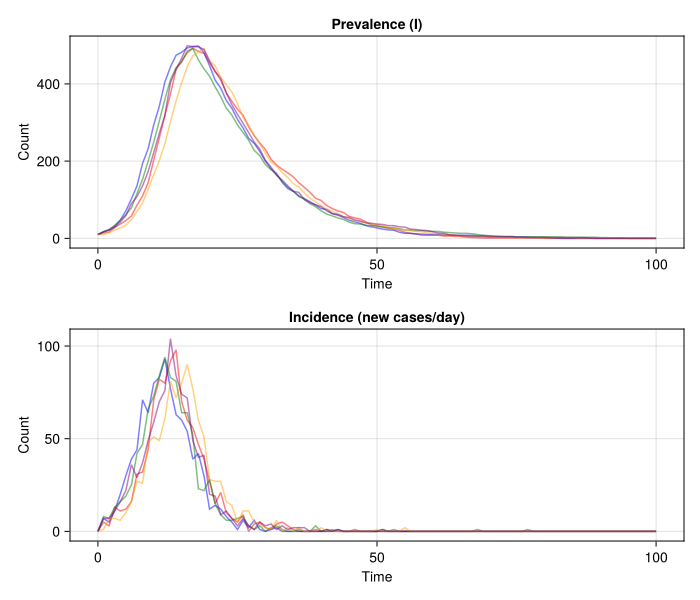

# Incidence Tracking


- [Introduction](#introduction)
- [Model with Incidence Tracking](#model-with-incidence-tracking)
- [Simulation](#simulation)
- [Visualising Incidence](#visualising-incidence)
- [Summary](#summary)

## Introduction

Tracking incidence (new cases per time period) is essential for fitting
models to surveillance data. In R odin2, this is done with the
`zero_every` feature. Here we implement the same pattern in Julia using
a discrete-time simulator that resets the incidence counter at each
observation time.

## Model with Incidence Tracking

``` julia
using Distributions
using Random
using CairoMakie
using Statistics

function sir_incidence!(state, pars, dt)
    S, I, R, inc = state
    β, γ, N = pars.β, pars.γ, pars.N

    p_SI = 1 - exp(-β * I / N * dt)
    p_IR = 1 - exp(-γ * dt)
    n_SI = rand(Binomial(round(Int, S), clamp(p_SI, 0, 1)))
    n_IR = rand(Binomial(round(Int, I), clamp(p_IR, 0, 1)))

    state[1] = S - n_SI
    state[2] = I + n_SI - n_IR
    state[3] = R + n_IR
    state[4] = inc + n_SI  # accumulate within period
    return state
end

function simulate_incidence(pars, times; seed=42, n_particles=1)
    dt = times[2] - times[1]
    results = zeros(4, n_particles, length(times))

    for p in 1:n_particles
        Random.seed!(seed + p)
        state = [pars.N - pars.I0, Float64(pars.I0), 0.0, 0.0]
        results[:, p, 1] .= state

        for i in 2:length(times)
            state[4] = 0.0  # zero_every: reset incidence each step
            sir_incidence!(state, pars, dt)
            results[:, p, i] .= state
        end
    end
    return results
end
```

    simulate_incidence (generic function with 1 method)

## Simulation

``` julia
pars = (β=0.5, γ=0.1, I0=10.0, N=1000.0)
times = collect(0.0:1.0:100.0)
result = simulate_incidence(pars, times; seed=42, n_particles=5)
println("Result dimensions: ", size(result))
```

    Result dimensions: (4, 5, 101)

## Visualising Incidence

``` julia
colors = [:red, :blue, :green, :orange, :purple]

fig = Figure(size=(700, 600))
ax1 = Axis(fig[1, 1]; xlabel="Time", ylabel="Count", title="Prevalence (I)")
for i in 1:5
    lines!(ax1, times, result[2, i, :]; color=(colors[i], 0.5))
end

ax2 = Axis(fig[2, 1]; xlabel="Time", ylabel="Count", title="Incidence (new cases/day)")
for i in 1:5
    lines!(ax2, times, result[4, i, :]; color=(colors[i], 0.5))
end
fig
```



## Summary

``` julia
mean_inc = mean(result[4, :, :]; dims=1)[1, :]
peak_day = times[argmax(mean_inc)]
println("Peak incidence at day: ", peak_day)
println("Peak mean incidence: ", round(maximum(mean_inc); digits=1))
println("Cumulative incidence: ", round(sum(mean_inc); digits=1))
```

    Peak incidence at day: 13.0
    Peak mean incidence: 87.4
    Cumulative incidence: 985.2
