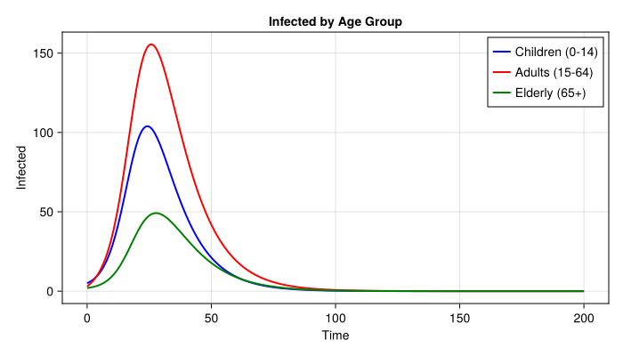
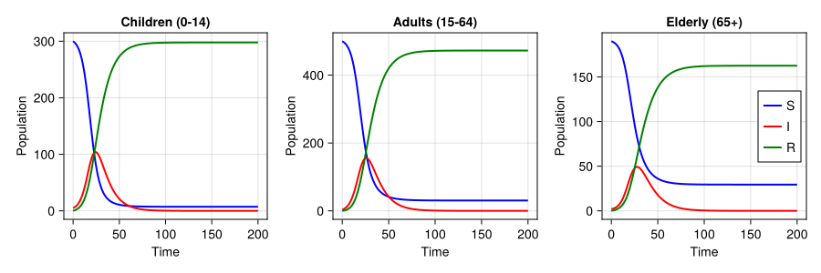

# Age-Structured SIR with Arrays


- [Introduction](#introduction)
- [Model Definition](#model-definition)
- [Simulation](#simulation)
- [Visualising by Age Group](#visualising-by-age-group)
- [Final Attack Rates](#final-attack-rates)

## Introduction

This vignette demonstrates an age-structured SIR model using
ModelingToolkit.jl. In R odin2, array state variables are declared with
`dim()` and indexed with `[i]`. In ModelingToolkit.jl, we use
vector-valued symbolic variables.

## Model Definition

We define a 3-age-group SIR model where each group has its own
transmission rate but shares a recovery rate. The force of infection
depends on the total number of infected across all groups.

``` julia
using ModelingToolkit
using ModelingToolkit: t_nounits as t, D_nounits as D
using DifferentialEquations
using CairoMakie

n_age = 3

@parameters β1=0.4 β2=0.3 β3=0.2 γ=0.1 N_pop=1000.0
@variables S1(t)=300.0 S2(t)=500.0 S3(t)=190.0
@variables I1(t)=5.0 I2(t)=3.0 I3(t)=2.0
@variables R1(t)=0.0 R2(t)=0.0 R3(t)=0.0

total_I = I1 + I2 + I3

eqs = [
    D(S1) ~ -β1 * S1 * total_I / N_pop,
    D(S2) ~ -β2 * S2 * total_I / N_pop,
    D(S3) ~ -β3 * S3 * total_I / N_pop,
    D(I1) ~ β1 * S1 * total_I / N_pop - γ * I1,
    D(I2) ~ β2 * S2 * total_I / N_pop - γ * I2,
    D(I3) ~ β3 * S3 * total_I / N_pop - γ * I3,
    D(R1) ~ γ * I1,
    D(R2) ~ γ * I2,
    D(R3) ~ γ * I3,
]

@named sir_age = ODESystem(eqs, t)
sir_age = structural_simplify(sir_age)
```

    Model sir_age:
    Equations (9):
      9 standard: see equations(sir_age)
    Unknowns (9): see unknowns(sir_age)
      R3(t)
      R2(t)
      R1(t)
      I3(t)
      ⋮
    Parameters (5): see parameters(sir_age)
      β1
      N_pop
      β2
      β3
      ⋮

## Simulation

``` julia
tspan = (0.0, 200.0)
prob = ODEProblem(sir_age, [], tspan)
sol = solve(prob, Tsit5(); saveat=0.5)
println("Solution length: ", length(sol.t))
```

    Solution length: 401

## Visualising by Age Group

``` julia
age_labels = ["Children (0-14)", "Adults (15-64)", "Elderly (65+)"]
colors = [:blue, :red, :green]
I_vars = [sir_age.I1, sir_age.I2, sir_age.I3]
S_vars = [sir_age.S1, sir_age.S2, sir_age.S3]
R_vars = [sir_age.R1, sir_age.R2, sir_age.R3]

fig = Figure(size=(700, 400))
ax = Axis(fig[1, 1]; xlabel="Time", ylabel="Infected", title="Infected by Age Group")
for i in 1:n_age
    lines!(ax, sol.t, sol[I_vars[i]]; label=age_labels[i], color=colors[i], linewidth=2)
end
axislegend(ax; position=:rt)
fig
```



``` julia
fig2 = Figure(size=(900, 300))
for g in 1:n_age
    ax = Axis(fig2[1, g]; xlabel="Time", ylabel="Population", title=age_labels[g])
    lines!(ax, sol.t, sol[S_vars[g]]; color=:blue, linewidth=2, label="S")
    lines!(ax, sol.t, sol[I_vars[g]]; color=:red, linewidth=2, label="I")
    lines!(ax, sol.t, sol[R_vars[g]]; color=:green, linewidth=2, label="R")
    if g == n_age
        axislegend(ax; position=:rc)
    end
end
fig2
```



## Final Attack Rates

``` julia
S0 = [300.0, 500.0, 190.0]
I0 = [5.0, 3.0, 2.0]

for g in 1:n_age
    R_final = sol[R_vars[g]][end]
    N_group = S0[g] + I0[g]
    ar = 100 * R_final / N_group
    println(age_labels[g], ": Attack rate = ", round(ar; digits=1), "%")
end
```

    Children (0-14): Attack rate = 97.6%
    Adults (15-64): Attack rate = 93.9%
    Elderly (65+): Attack rate = 84.7%
