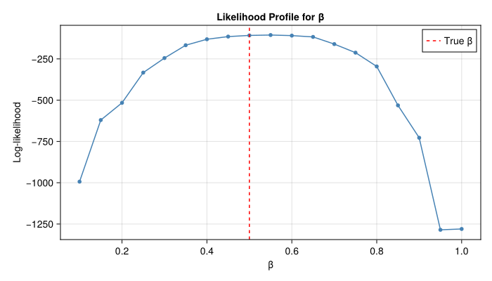

# Particle Filter and Likelihood


- [Introduction](#introduction)
- [Model with Data Comparison](#model-with-data-comparison)
- [Bootstrap Particle Filter](#bootstrap-particle-filter)
- [Generate Synthetic Data](#generate-synthetic-data)
- [Running the Particle Filter](#running-the-particle-filter)
- [Likelihood Surface](#likelihood-surface)

## Introduction

This vignette implements a bootstrap particle filter for likelihood
estimation, equivalent to dust2’s `dust_filter_create()` /
`dust_likelihood_run()`. We build a simple particle filter from scratch
using the stochastic SIR model, then compute log-likelihoods and explore
the likelihood surface.

## Model with Data Comparison

The stochastic SIR model with Poisson observation likelihood.

``` julia
using Distributions
using Random
using CairoMakie
using Statistics

function sir_step!(state, pars, dt, rng)
    S, I, R, inc = state
    β, γ, N = pars.β, pars.γ, pars.N

    p_SI = 1 - exp(-β * I / N * dt)
    p_IR = 1 - exp(-γ * dt)
    n_SI = rand(rng, Binomial(round(Int, S), clamp(p_SI, 0, 1)))
    n_IR = rand(rng, Binomial(round(Int, I), clamp(p_IR, 0, 1)))

    state[1] = S - n_SI
    state[2] = I + n_SI - n_IR
    state[3] = R + n_IR
    state[4] = inc + n_SI
    return state
end
```

    sir_step! (generic function with 1 method)

## Bootstrap Particle Filter

``` julia
function bootstrap_filter(pars, data_times, data_cases;
                          n_particles=100, dt=1.0, seed=42)
    rng = MersenneTwister(seed)
    n_times = length(data_times)
    n_state = 4  # S, I, R, incidence

    particles = zeros(n_state, n_particles)
    for j in 1:n_particles
        particles[:, j] .= [pars.N - pars.I0, Float64(pars.I0), 0.0, 0.0]
    end

    log_likelihood = 0.0
    t_current = 0.0

    for ti in 1:n_times
        t_next = data_times[ti]
        n_steps = round(Int, (t_next - t_current) / dt)

        # Advance particles
        for j in 1:n_particles
            particles[4, j] = 0.0  # reset incidence
            state = @view particles[:, j]
            for _ in 1:n_steps
                sir_step!(state, pars, dt, rng)
            end
        end

        # Compute weights (Poisson likelihood)
        log_weights = zeros(n_particles)
        for j in 1:n_particles
            λ = particles[4, j] + 1e-6
            log_weights[j] = logpdf(Poisson(λ), data_cases[ti])
        end

        # Log-sum-exp for marginal likelihood
        max_lw = maximum(log_weights)
        log_likelihood += max_lw + log(mean(exp.(log_weights .- max_lw)))

        # Systematic resampling
        weights = exp.(log_weights .- maximum(log_weights))
        weights ./= sum(weights)
        indices = systematic_resample(weights, n_particles, rng)
        particles .= particles[:, indices]

        t_current = t_next
    end
    return log_likelihood
end

function systematic_resample(weights, n, rng)
    positions = (collect(0:n-1) .+ rand(rng)) ./ n
    cumw = cumsum(weights)
    indices = zeros(Int, n)
    j = 1
    for i in 1:n
        while cumw[j] < positions[i]
            j += 1
        end
        indices[i] = j
    end
    return indices
end
```

    systematic_resample (generic function with 1 method)

## Generate Synthetic Data

``` julia
true_pars = (β=0.5, γ=0.1, I0=10.0, N=1000.0)
data_times = collect(1.0:1.0:50.0)

# Generate ground truth
rng = MersenneTwister(1)
state = [true_pars.N - true_pars.I0, Float64(true_pars.I0), 0.0, 0.0]
observed_cases = Int[]
for ti in 1:length(data_times)
    state[4] = 0.0
    sir_step!(state, true_pars, 1.0, rng)
    push!(observed_cases, round(Int, state[4]))
end
println("Observed cases (first 10): ", observed_cases[1:10])
```

    Observed cases (first 10): [2, 7, 6, 14, 20, 28, 30, 49, 64, 80]

## Running the Particle Filter

``` julia
ll = bootstrap_filter(true_pars, data_times, observed_cases;
                      n_particles=100, seed=42)
println("Log-likelihood at true parameters: ", round(ll; digits=2))
```

    Log-likelihood at true parameters: -107.91

## Likelihood Surface

``` julia
betas = 0.1:0.05:1.0
lls = [bootstrap_filter((β=b, γ=0.1, I0=10.0, N=1000.0),
                         data_times, observed_cases;
                         n_particles=100, seed=42)
       for b in betas]

fig = Figure(size=(700, 400))
ax = Axis(fig[1, 1]; xlabel="β", ylabel="Log-likelihood",
          title="Likelihood Profile for β")
scatterlines!(ax, collect(betas), lls; markersize=8, color=:steelblue)
vlines!(ax, [0.5]; linestyle=:dash, color=:red, label="True β")
axislegend(ax; position=:rt)
fig
```


